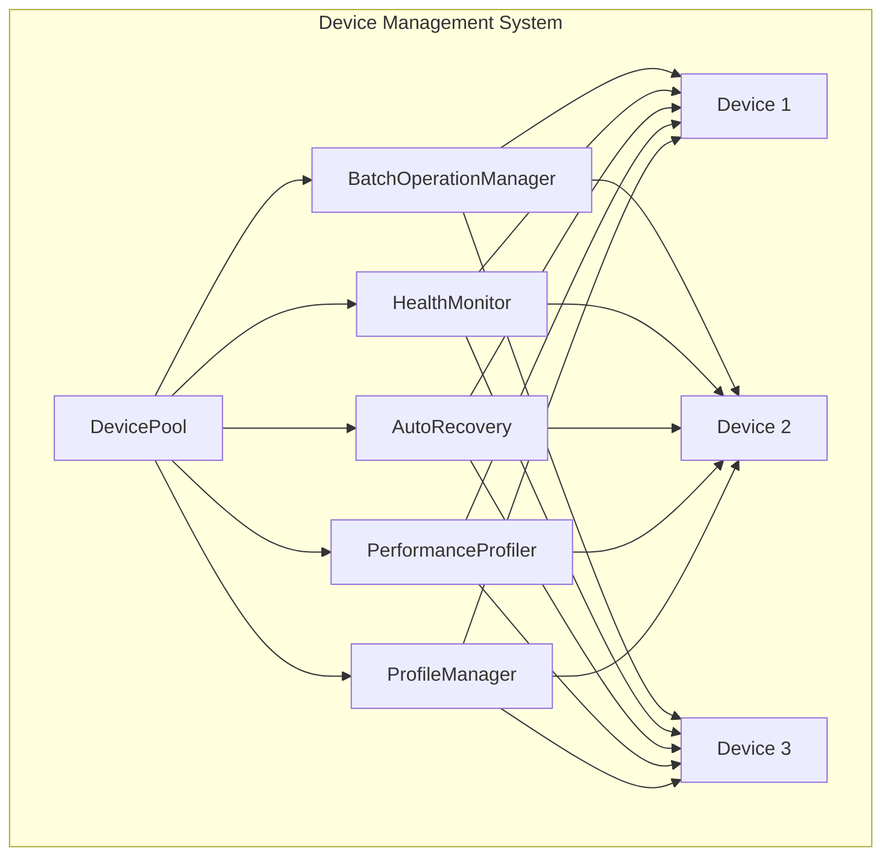
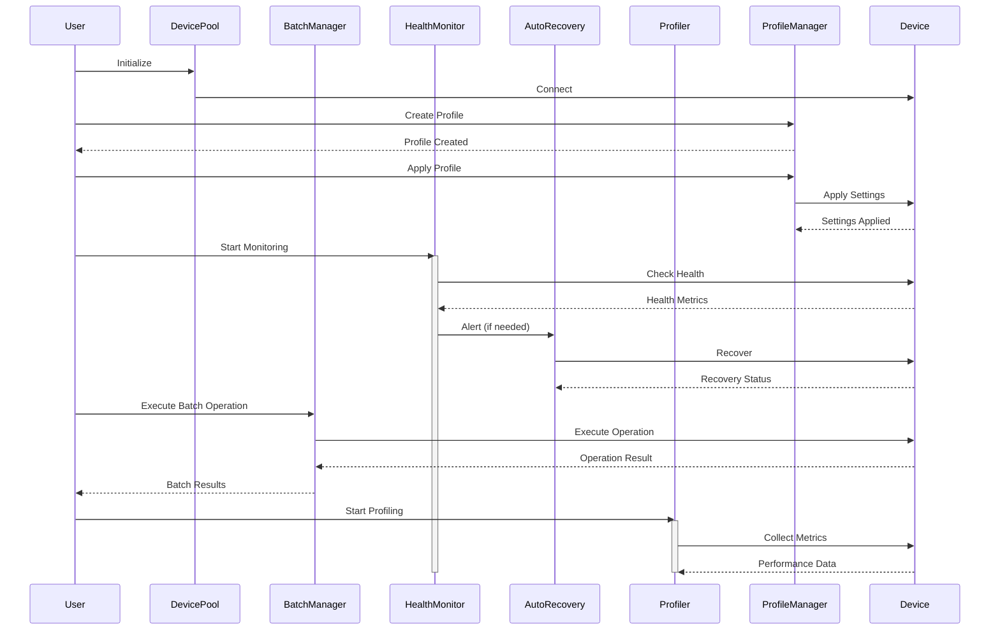
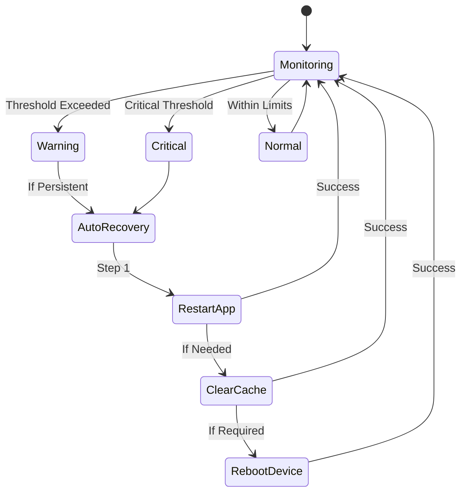
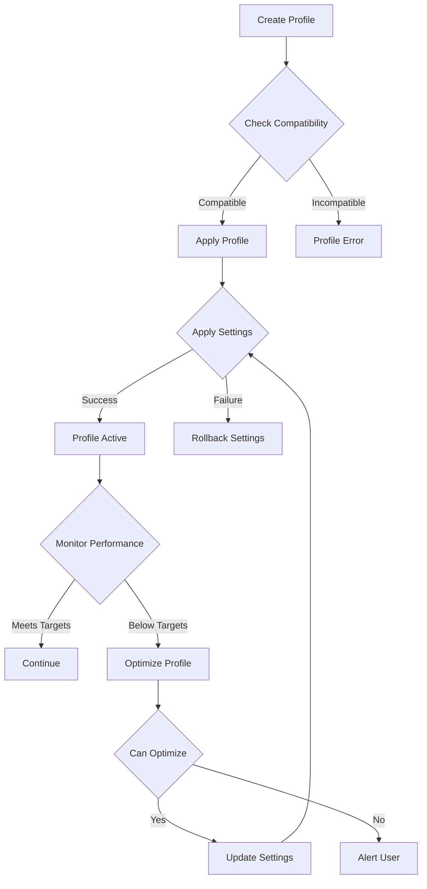
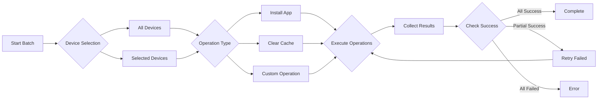
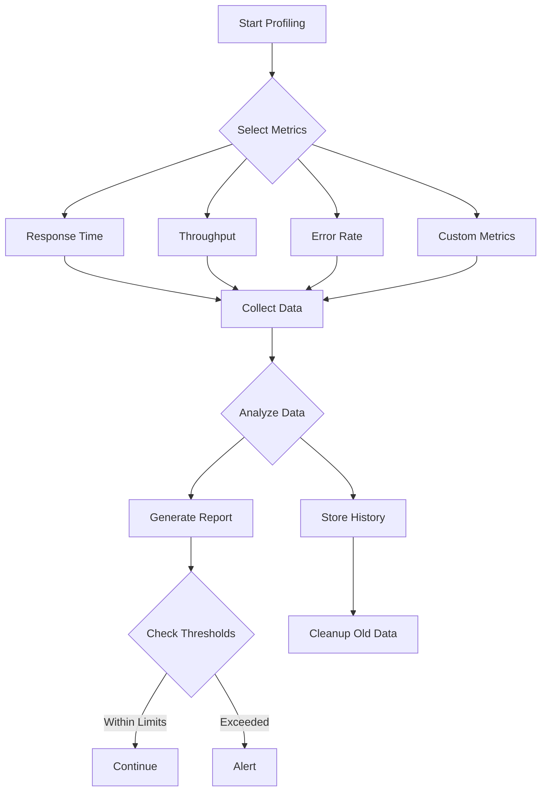
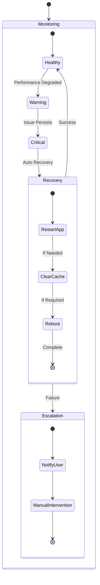
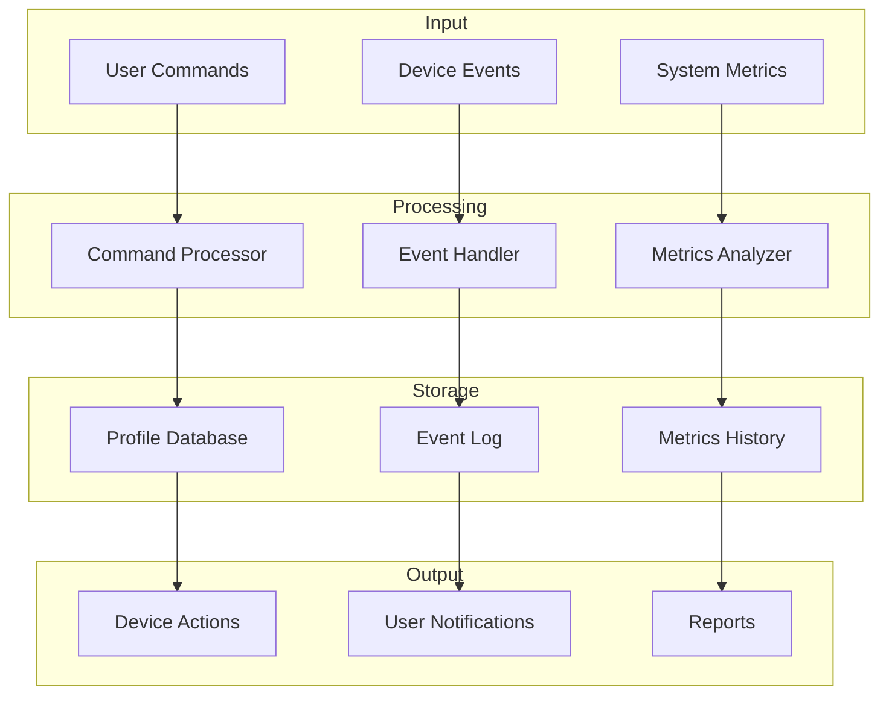

# SoloX System Architecture Diagrams

## Component Overview

## Component Interactions

## Health Monitoring Flow

## Profile Management Flow

## Batch Operation Process

## Performance Profiling Process

## Recovery Process

## Data Flow

